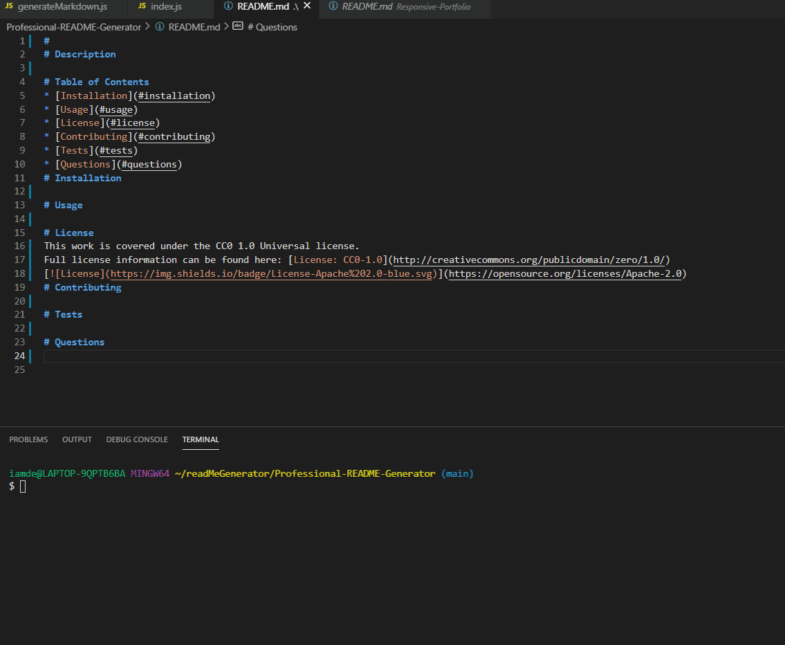

# Professional README Generator
# Description
A node.js application that allows a user to create a professional README file from the command line.
# Deployed site:
 [EXAMPLE README](https://deseancarter.github.io/Professional-README-Generator/)
 # In Progress

# Table of Contents
* [Installation](#installation)
* [Usage](#usage)
* [License](#license)
* [Contributing](#contributing)
* [Tests](#tests)
* [Questions](#questions)
# Installation
npm init. npm install inquirer.
# Usage
Run in command line the answer questions to generate READMME file.
# License
This work is covered under the Licensed under the Apache License, Version 2.0
Full license information can be found here: [License](https://www.opensource.org/licenses/Apache-2.0)

# Contributing
N/A
# Tests
Install and run.
# Questions
Email your questions to deseancarter1990@gmail.com
